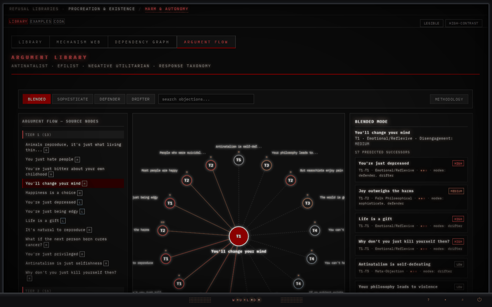
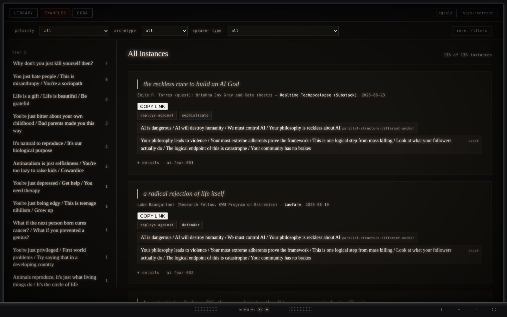

# efilist argument library

A structured taxonomy of objections to antinatalism. **78 objections across 5 tiers**, attached to **34 psychological mechanisms**, with **136 attested real-world deployments** mapped to four interlocutor archetypes — *sophisticate, defender, drifter, blended*.

This is taxonomic work, not advocacy. The objections are catalogued as live moves in real discourse, not strawmen and not specimens. The descriptive content stands as observation regardless of whether you share the suffering-priority axiom; the closing **coda** makes that axiom visible as a stake rather than a derivation. Read both.

---

## Open it (no download required)

The library is one self-contained HTML file. You do not have to clone or download anything to use it:

- **Live:** **[library.wuld.ink](https://library.wuld.ink)** — the deployed single-file build. Three surfaces behind an outer hash router:
  - [`library.wuld.ink/#/library`](https://library.wuld.ink/#/library) — the taxonomy + force-directed Map 1
  - [`library.wuld.ink/#/rwe`](https://library.wuld.ink/#/rwe) — the 136 attested real-world deployments
  - [`library.wuld.ink/#/coda`](https://library.wuld.ink/#/coda) — the closing artifact on the load-bearing axiom
- **From this repo, no clone:** open `combined.html` through a raw HTML proxy — e.g. `https://raw.githack.com/alisendjsc-crypto/efilist-argument-library/main/combined.html`. (The file is ~2.2 MB; small-file preview proxies may choke — `raw.githack` handles it.)
- **Offline:** download `combined.html` and open it directly in any modern browser. No build step, no server.

> Surface-level links only. Per-objection deep-link grammar inside `#/library` is **not yet resolved** against the router and is deliberately not published here — linking a bare objection id is not guaranteed to address an objection under the outer hash router. Use the three surface routes above.

---

## What it looks like

**Argument Flow — Map 1, the next-move predictor.** Pick a source objection; the map renders predicted successor moves across the selected archetype (here: *blended*), with convergence-tier and mode annotations.



**Real-world examples — attested in the wild.** Every catalogued move is grounded in an observed deployment, with provenance and a bounded (<15-word) quotation.



Further views — the dependency graph, the mechanism web, an objection-detail deconstruction with RSI, and the surface chrome — are in [`screenshots/`](screenshots/) and walked through in [`instructions.md`](instructions.md). A standalone `rwe.html` (new at v3.7.3) packages the real-world-examples surface for direct viewing or downstream tooling.

> **Rendered-counter note (resolved in v3.7.2; held at v3.7.3).** The static chrome in the dependency-graph and mechanism-web headers previously displayed a *pre-sweep* `74` / `222`. The v3.7.2 content-advance re-cut corrected it (length-preserving, byte-neutral): both headers now read **78 objections / 245 dependencies**, matching the canon-attested invariant truth (**78 objections / 245 dependencies / 91 dependency-graph nodes**). v3.7.3 is PATCH-class; the chrome is unchanged.

---

## The deliverable

The shippable artifact is a single file: **`combined.html`**. Library, real-world-examples table, and coda are absorbed into it behind the outer hash router. Works offline, no build step.

**Verbatim-artifact provenance (the integrity contract):**

| Field | Value |
|---|---|
| File | `combined.html` |
| Version tag | `v3.7.3` |
| md5 | `29f9d5c0d4befac52dae4ca88ea4211f` |
| Size | `2,243,165` bytes |

That md5 is binding. The file ships **verbatim** — no regeneration, no whitespace cleanup, no key reordering. A drifted hash is a corrupted artifact (cross-platform line-ending conversion is the usual culprit; the repo's `.gitattributes` enforces LF).

The binding integrity source is the project canon's `archive_attestation` block (canon v30.0, attested at the v3.7.3 finalization via the `invariant_derivation_harness_v1` hard gate, GREEN exit 0). `release_manifest_v3_7_1.json` in this repo is a **reconstructed** manifest carrying the *invariant attestation* (node/edge/distribution counts), not the md5/sha256 artifact set; the md5 contract above is canon-authoritative against `release_artifact_md5_set_per_release_manifest_v3_7_3`.

---

## Status

**Archived stable** at **v3.7.3** (canon v30.0 line; `project_terminal_state: archived_v3_7_3_stable`; `next_recommended_session: null`). v3.7.3 is a **PATCH** over the v3.7 line — a `benatar-asymmetry-attack` long-form strengthen + ledger sync re-cut: the long form expanded from 4904ch single-paragraph to 8205ch four-paragraph treatment, axes re-cut to `{v0.88, s0.81, c0.80, r0.78, a0.84}`, `long.rsi_pct` 78.3 → 82.13, `long.grade` **C → B**. The corpus's two highest-deployment objections (`violence-as-reductio` cleared at v3.7.2, `benatar-asymmetry-attack` cleared here) are now both B-band; the deployment × grade danger quadrant is **empty at v3.7.3**.

Structural invariants are byte-identical to the v3.7 line (this is why it is PATCH-class, **not** v3.8); corpus taxonomic content unchanged at 78 objections; `combined.html` re-synced to the v3.7.3 corpus (the v3.7.2-era coherence-note flag on benatar long-form para-1-only divergence is now closed). The prior v3.7.2 published set is retained in canon as historical-superseded for audit continuity. No scheduled successor; no forcing function for v3.8. Future maintenance is operator-elective and topic-scoped.

See [`CHANGELOG.md`](CHANGELOG.md) for per-release detail across v3.7-stable / v3.7.1 / v3.7.2 / v3.7.3.

If you find an objection missing or a mechanism mis-attached, that's a topic for a future operator-elective micro-session, not a patch to this release.

---

## What's in the single file

`combined.html` carries three surfaces behind the hash router:

- **`#/library`** — the 78-objection taxonomy across 5 tiers, the 34 mechanism attributions, the dependency graph (**91 nodes** = 78 objections + 13 premises; **245 links**, 161 strong / 84 weak), the mechanism web (112 nodes, 133 links), and the force-directed Map 1 across the four archetypes (2,886 transition edges).
- **`#/rwe`** — the 136 attested real-world deployments, schema v1.6.
- **`#/coda`** — the closing artifact on the axiom this library does not derive.

The regenerable sources behind the single file — the authoritative corpus JSON, the denormalized JSX sibling, the canonical HTML source, the RWE schema (v1.6), and the v3′-strict + v1.6 validator — remain in the source tree and are **not deprecated**. See [`instructions.md`](instructions.md) for programmatic use and the per-file integrity set.

---

## Reading

Open the library, land on `#/library`, pick a tier 1 or tier 2 objection, read its responses, then follow a few archetype transitions outward. Open `#/coda` *after* — not before — the taxonomy feels familiar. Then return to the library with the coda's framing in mind.

For a longer guide — archetype semantics, the dependency graph, real-world-examples, programmatic use, integrity verification — see [`instructions.md`](instructions.md). For corpus-level numbers (transition counts, grade distribution, the deployment×grade danger quadrant, the RSI calculus), see [`STATISTICS.md`](STATISTICS.md).

---

## Cite

A `CITATION.cff` (CFF 1.2.0) is provided at repository root and enables GitHub's "Cite this repository" widget. BibTeX:

```bibtex
@misc{efilist_argument_library_2026,
  title   = {efilist argument library},
  author  = {Cooper, Josiah S.},
  year    = {2026},
  version = {3.7.3},
  url     = {https://github.com/alisendjsc-crypto/efilist-argument-library},
  note    = {Archived stable release}
}
```

---

## License

- Corpus, JSX, schema, single-file HTML (`combined.html`), coda: **CC-BY-4.0**. Attribution required; no share-alike obligation.
- The v3′-strict + v1.6 validator (`v3prime_validator_v1_6.py`): **MIT**.

Attribution per `CITATION.cff`. Verbatim citation and adaptation both require attribution under CC-BY-4.0; the validator code is permissive.

> **Note on GitHub's "Unknown" license badge.** GitHub's license detector (Licensee) matches a single root `LICENSE` against canonical SPDX license bodies at a high similarity threshold. The current `LICENSE` is a human-worded CC-BY-4.0 *summary*, and the repo is content/code dual-licensed (`LICENSE` = CC-BY-4.0, `LICENSE-CODE` = MIT), neither of which GitHub auto-detects. To make the badge read **CC-BY-4.0**: replace the body of `LICENSE` with the verbatim canonical CC BY 4.0 legal text (`creativecommons.org/licenses/by/4.0/legalcode.txt`) and move the custom attribution/scope prose into a `NOTICE` file or keep it in this section. `LICENSE-CODE` (MIT) and `CITATION.cff` (`license: CC-BY-4.0`) need no change. This is an operator-elective cosmetic fix — the licensing of the work is unaffected and fully stated above.

---

## On the standpoint

The library does not derive the suffering-priority axiom from anything more basic and does not pretend to. The coda is the explicit account of that floor. The descriptive content — the taxonomy, the dependency graph, the mechanism attributions, the attested examples — stands as observation regardless of where you land on the axiom itself.

The library ends here. What remains is the act of standing on it.
