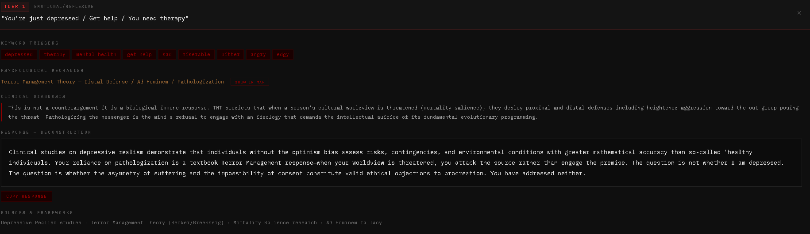
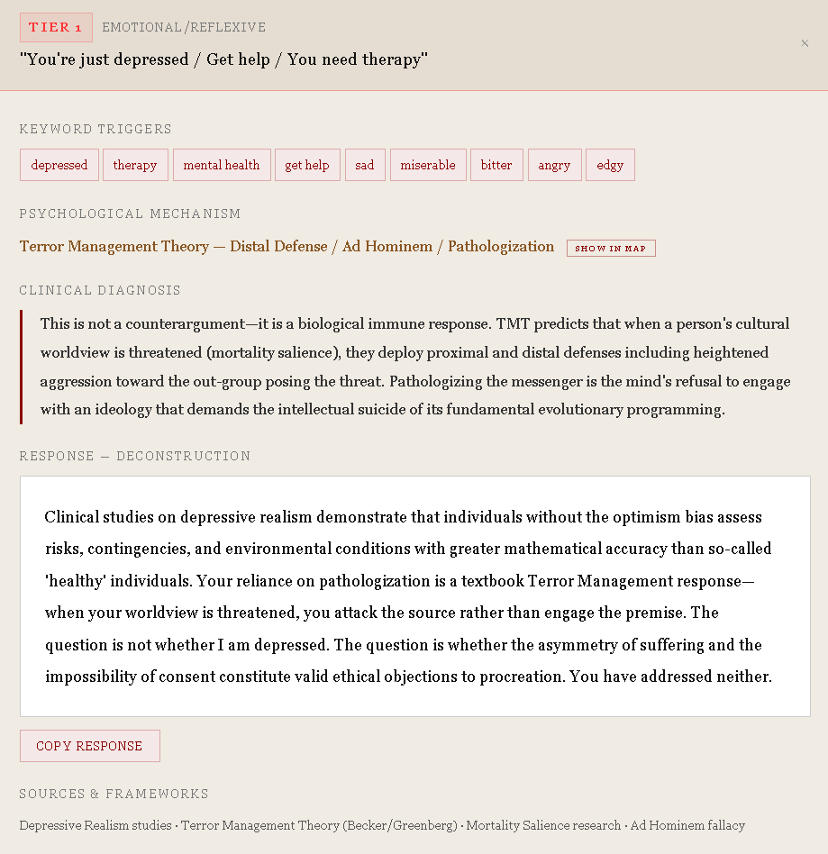
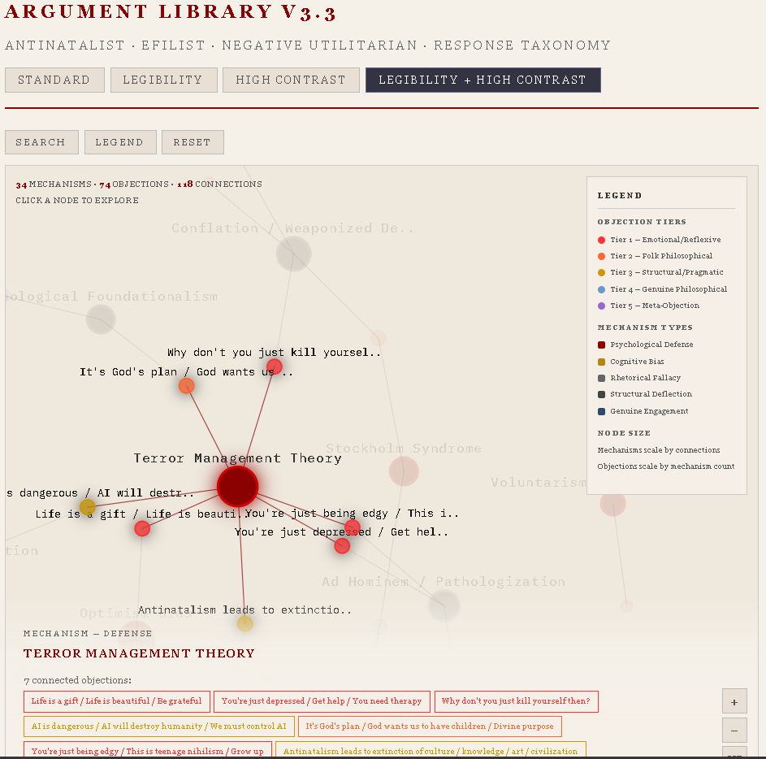
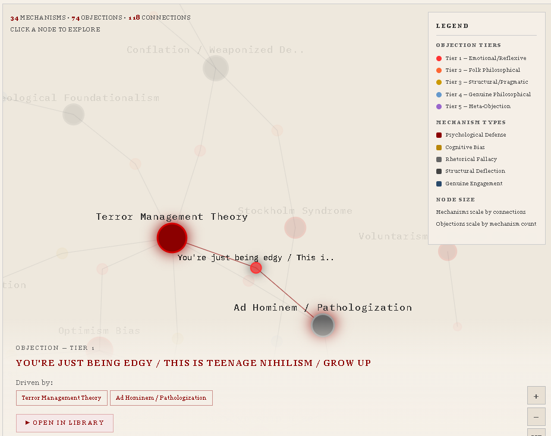

# EFIList Argument Library v3.3

A comprehensive, searchable reference tool for antinatalist, EFIList, and negative utilitarian counter-arguments — now with an integrated Psychological Mechanism Web. Built for anyone engaged in philosophical discourse around the ethics of procreation, the problem of suffering, and the structural critique of biological existence.

## What This Is

74 objections to antinatalism and EFIList philosophy — mapped, diagnosed, and countered at three levels of depth. Every entry includes keyword triggers for rapid identification, a psychological mechanism diagnosis explaining *why* the interlocutor deploys this particular objection, a clinical analysis of the objection's logical structure, and pre-built responses at three levels: **Punch** (concise, one-hit), **Deconstruct** (medium engagement), and **Dismantle** (full philosophical counter-argument).

The tool is designed for real-world use: search for a phrase you've encountered in a debate, identify the objection category, select your response depth, and copy it to clipboard.

## Preview

### Library — Standard Mode
*Search, filter, and deploy responses from 74 indexed objections.*

### Library — Legibility + High Contrast
*Accessibility-first display: serif typeface, expanded spacing, warm parchment background.*

### Psychological Mechanism Web — Mechanism Selected
*Terror Management Theory highlighted — revealing 7 connected objections across Tiers 1–3.*

### Mechanism Web — Objection Selected
*Click any objection to see which psychological mechanisms drive it, then jump directly to the library entry.*

## What's New in v3.3

**Psychological Mechanism Web** — an interactive force-directed network graph (D3.js) that maps the psychological mechanisms driving all 74 objections. 34 canonical mechanism clusters (Terror Management Theory, Optimism Bias, Survivorship Bias, etc.) are connected to the objections they fuel via 118 edges. Click a mechanism node to see every objection it drives. Click an objection to see which mechanisms produce it. Reveals that most Tier 1–2 objections are 2–3 psychological reflexes wearing different rhetorical costumes.

**Bidirectional cross-linking** — every entry in the library has a "SHOW IN MAP" button that switches to the Mechanism Web with that node highlighted. Every node in the map has an "OPEN IN LIBRARY" button that switches back and scrolls to the full entry. The two views are a single integrated tool.

**Confidence indicator system** (added in v3.2) — entries where the Dismantle-level response has identifiable limitations display a confidence badge (STRONG or PROVISIONAL) and an expandable methodological note explaining the constraint.

## Coverage

| Tier | Description | Entries |
|------|-------------|---------|
| **Tier 1** | Emotional / Reflexive — high frequency, low rigor | 13 |
| **Tier 2** | Folk Philosophical — surface-level logic that collapses under scrutiny | 14 |
| **Tier 3** | Structural / Pragmatic — policy-adjacent deflections | 13 |
| **Tier 4** | Genuine Philosophical — rigorous challenges requiring sharp responses | 28 |
| **Tier 5** | Meta-Objections — attacks on the framework's internal coherence | 6 |

**222 total pre-built responses** across all entries and depth levels. Estimated real-world encounter coverage: **96–98%** across internet discourse, casual conversation, and structured debate.

## Features

- **Keyword search** — type any phrase or concept to find matching objections instantly
- **Tier filtering** — isolate by objection sophistication level
- **Three response depths** — Punch, Deconstruct, Dismantle
- **Psychological Mechanism Web** — interactive D3.js force-directed graph mapping mechanisms to objections
- **Bidirectional cross-linking** — jump between library entries and map nodes
- **Confidence indicators** — methodological transparency on response limitations
- **Copy to clipboard** — one click on any response
- **Four display modes** — Standard (dark/brutalist), Legibility (large serif type), High Contrast (light background), and Legibility + High Contrast combined

## Files

| File | Description |
|------|-------------|
| `index.html` | **Primary tool** — online version, D3.js loaded from CDN. This is what GitHub Pages serves. |
| `efilist_argument_library_v33_offline.html` | Fully self-contained offline version — D3.js embedded (~700KB). Works without internet. |
| `efilist_argument_library.json` | Raw data file — all 74 entries with full metadata, for integration into other tools or analysis |
| `efilist_argument_library.jsx` | React component version — importable into any React project |

## How to Use

**Online:** Visit [alisendjsc-crypto.github.io/efilist-argument-library](https://alisendjsc-crypto.github.io/efilist-argument-library)

**Offline:** Download `efilist_argument_library_v33_offline.html` and open it in any browser.

**In a React project:** Import `efilist_argument_library.jsx` as a component.

**Data only:** Use `efilist_argument_library.json` to build your own interface or run analysis.

## Mechanism Web — What It Reveals

The Psychological Mechanism Web maps 34 canonical mechanism clusters to 74 objections:

- **Terror Management Theory** (Becker) drives 7 objections across Tiers 1–3 — "Life is a gift," "You're just edgy," "God's plan," and "Extinction of culture" are all mortality salience in different costumes
- **Optimism Bias / Pollyanna Principle** threads through 5 entries including "Most people are happy" and "The world is getting better"
- **Survivorship Bias** appears in 5 entries — from individual self-report ("I'm happy, therefore existence is good") to civilizational-scale selective framing (Pinker)
- **Genuine Philosophical Challenge** forms a cluster of 24 entries (nearly all Tier 4), confirming that genuine engagement shares a meta-type even when content diverges
- **Formal Logic Attack** connects 11 entries — the subset of genuine challenges that attack the logical architecture directly

Mechanism types are color-coded: psychological defense (red), cognitive bias (amber), rhetorical fallacy (gray), structural deflection (dark gray), genuine engagement (blue).

## Philosophical Sources

Draws from David Benatar, Arthur Schopenhauer, Peter Wessel Zapffe, Thomas Ligotti, Emil Cioran, Gary Mosher (InMendham), Philipp Mainländer, David Hume, John Stuart Mill, Ernest Becker (Terror Management Theory), Tali Sharot (Optimism Bias), Viktor Frankl, Friedrich Nietzsche, David Pearce, Derek Parfit, Ben Bradley, David Boonin, Elizabeth Harman, T.M. Scanlon, Virginia Held, Martha Nussbaum, Arne Næss, Mihaly Csikszentmihalyi, William James, John Dewey, Nel Noddings, Buddhist philosophy (dukkha/śūnyatā), Jain philosophy (ahimsa), Indigenous philosophical traditions, Ecclesiastes, and original corpus research.

## Accessibility

The tool includes display modes for users with visual impairments or reading difficulties. The Legibility mode increases all font sizes, switches to a serif typeface, expands line spacing, and constrains content width for comfortable reading. The High Contrast mode inverts the color scheme to dark text on a light background. Both can be combined. All four modes apply to both the library and the Mechanism Web.

## Version History

| Version | Changes |
|---------|---------|
| **v3.3** | Integrated Psychological Mechanism Web (D3.js force-directed graph), bidirectional cross-linking, view switcher |
| **v3.2** | Added 14 entries (gap analysis), confidence indicator system with methodological notes |
| **v3.1** | Added 8 academic entries (Parfit, Bradley, Scanlon, Boonin, Harman, etc.), zero-sum corrections |
| **v3.0** | Initial public release — 52 entries, 156 responses, 4 display modes |

## Contributing

If you encounter an objection in the wild that is not covered by this library, open an issue describing the objection, the context in which you encountered it, and (if possible) the strongest version of the argument. Contributions that expand coverage without degrading response quality are welcome.

## License

This tool is free to use, distribute, and modify. No attribution required, though appreciated. Built for the community.

---

*Labor Sine Fructu — but the library endures.*
