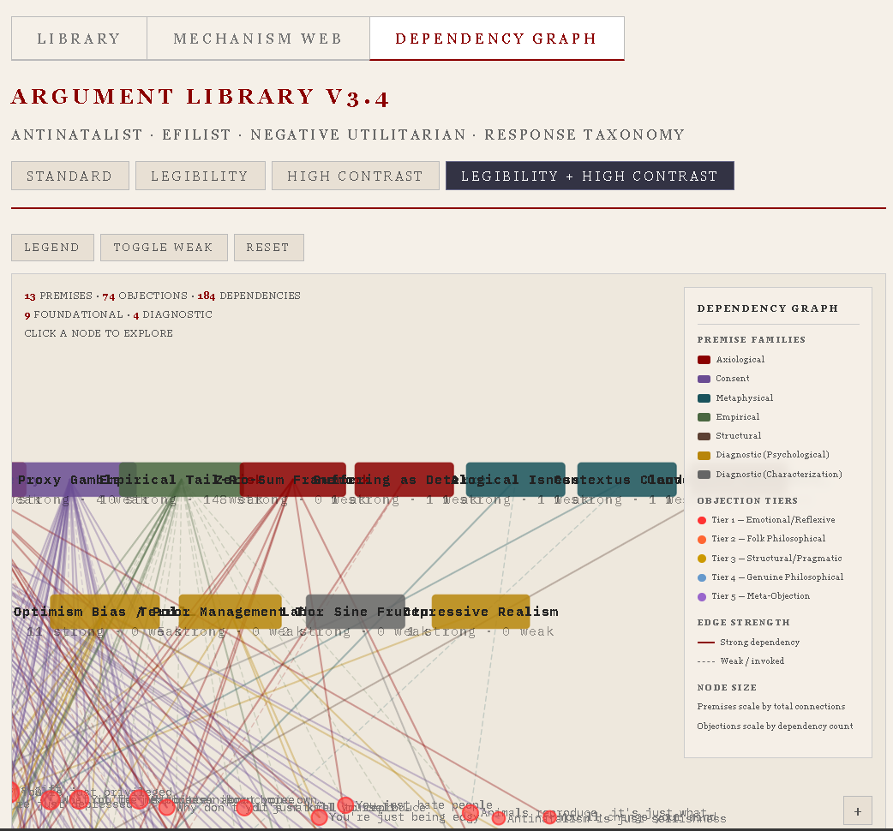

# EFIList Argument Library v3.4

A comprehensive, interactive tool for navigating and responding to objections against EFILism, antinatalism, and negative utilitarianism. 74 objections indexed across 5 tiers, with 222 pre-built responses at 3 depth levels. Three integrated visualization modes for structural analysis of the argument landscape.

Built with a Neobrutalist aesthetic matching the VOID ENGINE project parameters.

---

### **[▸ USE THE TOOL](https://alisendjsc-crypto.github.io/efilist-argument-library)**

No download required. Works in any modern browser.

Want an offline copy? Download [`efilist_argument_library_v34_offline.html`](efilist_argument_library_v34_offline.html) — a single self-contained file with everything embedded. Open it locally in any browser.

---

## How to Use It

### The Library (default view)

The Library is a searchable, filterable index of 74 common objections to EFILism and antinatalism. Each entry includes a trigger phrase (what the interlocutor actually says), a psychological diagnosis, and pre-written responses at three depth levels.

**Search:** Type any keyword into the search bar — it matches against trigger phrases, keywords, categories, and IDs. Useful when someone throws a specific line at you and you need to find the counter quickly.

**Tier Filters:** Objections are classified into five tiers of sophistication:

- **T1 — Emotional / Reflexive:** High frequency, low rigor. Defense mechanisms in argument costumes.
- **T2 — Folk Philosophical:** Surface-level logic that collapses in one or two moves.
- **T3 — Structural / Pragmatic:** Policy-adjacent objections that dodge the philosophy and carry weight through anxiety.
- **T4 — Genuine Philosophical:** Low frequency, high rigor. These require the sharpest responses.
- **T5 — Meta-Objection:** Attacks on the framework's own internal coherence.

Click a tier button to filter. Click ALL TIERS to reset.

**Response Depth:** Each objection has three response levels:

- **Punch** — A short, sharp counter. Enough for a comment section or a quick exchange.
- **Deconstruct** — A medium-length analytical response. Identifies the fallacy structure and dismantles the surface logic.
- **Dismantle** — A full-length, sourced demolition. Academic-grade engagement with the objection's philosophical foundations.

**Copy to Clipboard:** Every response has a copy button. Click it, paste it wherever you need it.

**Display Modes:** Four modes available in the top-right controls:

- Standard (default dark mode, IBM Plex Mono)
- Legibility (larger serif font, wider spacing)
- High Contrast (light background, dark text)
- Legibility + High Contrast (both combined)

**Confidence Indicators:** Some entries carry confidence badges (Full / Strong / Provisional) reflecting the methodological rigor of the response. Click the badge to see the methodological note.

### The Mechanism Web (Map 2)

Switch to this view using the **MECHANISM WEB** button in the top navigation bar.

This is a force-directed graph (D3.js) that maps the psychological mechanisms driving each objection. 34 canonical mechanism clusters are connected to 74 objection nodes via 118 edges.

- **Drag** nodes to rearrange the layout.
- **Click** any node to see its connections and details in the info panel.
- **"OPEN IN LIBRARY"** in the info panel jumps you to that objection's full entry.
- **"SHOW IN MAP"** from any library entry jumps you to that objection's position in the web.

Use this view to understand *why* someone is making a particular objection — the underlying psychological architecture rather than the surface argument.

### The Dependency Graph (Map 3)

Switch to this view using the **DEPENDENCY GRAPH** button in the top navigation bar.

This is a stratified layout showing which foundational philosophical premises each objection's response depends on. 13 premise nodes (9 foundational, 4 diagnostic) are connected to 74 objection nodes via 184 edges, classified by strength (strong dependency vs. weak/tangential).

- **Premise nodes** are color-coded by family: axiological, consent, metaphysical, empirical, structural, psychological, characterization.
- **Edge thickness** indicates dependency strength.
- **Click** any node for details. The info panel shows all connected premises or objections.
- **"OPEN IN LIBRARY"** and **"SHOW IN MECHANISM WEB"** buttons in the info panel cross-link to the other views.
- **Review badges** (Provisional / Review / Note) flag entries where the dependency mapping is under ongoing quality review.

Use this view to understand which premises are load-bearing across the argument landscape — and which objections target the same foundations.

### Cross-Linking

All three views are bidirectionally connected. You can jump from any entry in the Library to its position in either map, and from any map node back to its Library entry or across to the other map. The tool is designed so you never lose context when switching perspectives.

---

## Philosophical Frameworks Referenced

The responses draw on the following foundational premises and diagnostic frameworks:

| Premise | Description |
|---|---|
| **Benatar's Asymmetry** | Absence of pain is not bad; absence of pleasure is not bad (no one deprived). The framework has moved beyond requiring the strong "good" formulation. |
| **Proxy Gamble** | Parents wager with collateral that isn't theirs. The child bears 100% of existential risk. |
| **Consent Impossibility** | Informed consent from a non-existent subject is structurally impossible. |
| **Zero-Sum Framework** | No actual positive net value in experience. Pleasure is analgesic, not additive. (Gary Mosher / EFILism) |
| **Empirical Tail-Risk** | Procreation exposes the created entity to the full distribution of possible suffering outcomes. |
| **Suffering as Deterrence Force** | Suffering is inherently repulsive on a mechanic scale, functioning as deterrence. (Cooper addendum) |
| **Alogical Isness** | The universe is acausal, spontaneously generated, possessing no intrinsic meaning. |
| **Contextus Claudit** | The closed context — consciousness cannot perceive objective reality from within itself. |
| **Convergent Architecture** | The case stands on multiple independent foundations. Defeating one pillar does not collapse the structure. |
| **Terror Management Theory** | Mortality salience triggers aggressive worldview defense. (Becker) |
| **Optimism Bias / Pollyanna** | Hardwired overestimation of positive outcomes. (Sharot) |
| **Depressive Realism** | Pessimists may assess reality with greater objective accuracy. |
| **Labor Sine Fructu** | Labor without fruit — the EFIList characterization of biological existence. |

---

## Files in This Repository

| File | Description |
|---|---|
| [`index.html`](index.html) | The primary tool — served live via GitHub Pages. D3.js loaded from CDN. |
| [`efilist_argument_library_v34_offline.html`](efilist_argument_library_v34_offline.html) | Offline version — D3.js embedded (~788KB). Fully self-contained. |
| [`efilist_argument_library.json`](efilist_argument_library.json) | Raw data export — all 74 entries, dependency graph data, premise matrix. |
| [`efilist_argument_library.jsx`](efilist_argument_library.jsx) | React component — Library + Mechanism Web at full parity. Dep Graph data included but rendering component is partial. |
| `screenshots/` | Preview images of all three views. |

---

## Technical Notes

### Architecture

Three integrated views share a single `OBJECTIONS` array. D3.js lazy-initializes each map only when the user first switches to that view, keeping initial load fast. Cross-linking works in all directions via JavaScript functions that switch views and highlight the target node/entry.

The `DEP_GRAPH_DATA` variable holds all Map 3 data (premise nodes, objection nodes, edges with strength classification and layer assignment). `DEP_REVIEW_NOTES` holds review confidence flags for 17 entries and 5 premise-level structural observations.

### Data Format

Each entry in the `OBJECTIONS` array is an object with: `id`, `tier`, `category`, `trigger`, `keywords[]`, `psychMechanism`, `diagnosis`, `confidence`, `note` (optional), `responses{short, medium, long}`, `sources[]`.

### Known Data Quality Issues

The dependency graph (Map 3) was generated through a multi-pass extraction process (keyword inference → strength classification → manual overrides → review flagging). The top premises (Consent Impossibility, Benatar's Asymmetry, Proxy Gamble) are high-confidence. The bottom five premises (Suffering as Deterrence, Alogical Isness, Contextus Claudit, Convergent Architecture, Labor Sine Fructu) are almost certainly undercounted — they operate implicitly in many responses that don't use explicit marker phrases. 17 entries and 5 premise nodes carry review flags visible in the tool.

### Version History

- **v3.4** — Integrated Philosophical Dependency Graph (Map 3). 13 premise nodes, 184 edges with strength classification. Two-layer architecture. Review confidence system. Cross-linking across all three views.
- **v3.3** — Integrated Psychological Mechanism Web (Map 2). D3.js force-directed graph. 34 mechanism nodes, 118 edges. View switcher and bidirectional cross-linking.
- **v3.2** — Added 14 entries from gap analysis. Built confidence indicator system.
- **v3.1** — Added 8 academic entries. Integrated zero-sum correction and suffering-as-deterrence addendum.
- **v3.0** — Initial public release. 52 objections, 156 responses, keyword search, tier filtering.

---

## Author & Distribution

**Josiah S. Cooper** (AnomicIndividual87)

- [linktr.ee/WULD](https://linktr.ee/WULD)
- Public domain. Use it, share it, fork it, modify it. No permission needed.

---

*Part of the VOID ENGINE project.*

