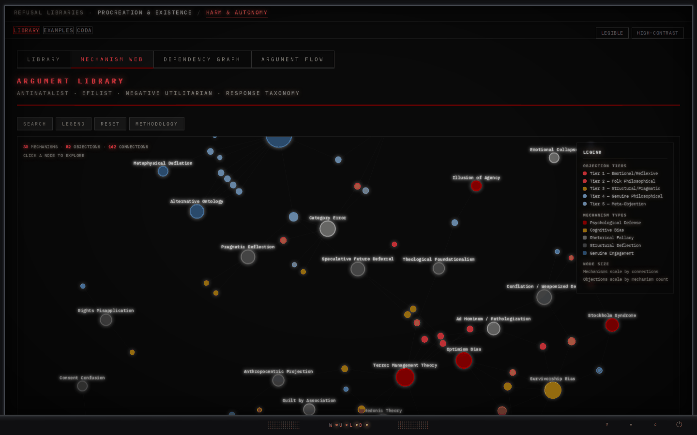

# EFIList Argument Library v3.4

A comprehensive, interactive tool for navigating and responding to objections against EFILism, antinatalism, and negative utilitarianism. Built with a Neobrutalist aesthetic matching the VOID ENGINE project parameters.

## What It Does

**74 objections** across 5 tiers, with **222 pre-built responses** at 3 depth levels (Punch / Deconstruct / Dismantle). Three integrated visualization modes for structural analysis of the argument landscape.

## Features

### Library View
- Full-text keyword search across all entries
- Tier filtering (Emotional/Reflexive → Meta-Objection)
- Three response depth levels with copy-to-clipboard
- Confidence indicator system with methodological notes
- 4 display modes: Standard, Legibility, High Contrast, Combined
- Cross-linking to both visual maps

### Mechanism Web (Map 2)
- D3.js force-directed graph
- **34 canonical mechanism clusters** connected to 74 objections via **118 edges**
- Mechanism nodes color-coded by type (Psychological Defense, Cognitive Bias, Rhetorical Fallacy, Structural Deflection, Genuine Engagement)
- Objection nodes color-coded by tier
- Click any node to explore connections
- Bidirectional cross-linking with library

### Dependency Graph (Map 3) — NEW in v3.4
- D3.js stratified hierarchical layout
- **13 premise nodes** (9 foundational, 4 diagnostic) connected to 74 objections via **184 edges**
- Two-layer premise architecture:
  - **Foundational Premises**: Benatar's Asymmetry, Proxy Gamble, Zero-Sum Framework, Consent Impossibility, Suffering as Deterrence, Alogical Isness, Contextus Claudit, Convergent Architecture, Empirical Tail-Risk
  - **Diagnostic Frameworks**: Terror Management Theory, Optimism Bias / Pollyanna, Depressive Realism, Labor Sine Fructu
- Edge strength classification: **strong** (solid lines — response structurally depends on premise) vs. **weak** (dashed — premise invoked but may not be load-bearing)
- Premise nodes sized by connection count, color-coded by family (axiological, consent, metaphysical, empirical, structural, psychological)
- Toggle weak dependencies on/off to see structural skeleton
- **Review confidence system**: Entries with known data quality concerns display PROVISIONAL, REVIEW, or NOTE badges with explanatory notes
- Click any premise to see all dependent objections; click any objection to see its premise chain
- Cross-linking to library and mechanism web

## Premise Load-Bearing Hierarchy

| Premise | Strong | Weak | Total | Layer |
|---|---|---|---|---|
| Consent Impossibility | 56 | 6 | 62 | Foundational |
| Benatar's Asymmetry | 19 | 14 | 33 | Foundational |
| Proxy Gamble | 27 | 4 | 31 | Foundational |
| Empirical Tail-Risk | 10 | 14 | 24 | Foundational |
| Optimism Bias / Pollyanna | 11 | 0 | 11 | Diagnostic |
| Zero-Sum Framework | 8 | 0 | 8 | Foundational |
| Terror Management Theory | 5 | 0 | 5 | Diagnostic |
| Suffering as Deterrence | 1 | 1 | 2 | Foundational |
| Alogical Isness | 1 | 1 | 2 | Foundational |
| Contextus Claudit | 1 | 1 | 2 | Foundational |
| Labor Sine Fructu | 2 | 0 | 2 | Diagnostic |
| Convergent Architecture | 1 | 0 | 1 | Foundational |
| Depressive Realism | 1 | 0 | 1 | Diagnostic |

## Tier Structure

- **Tier 1 — Emotional/Reflexive** (13 entries): Gut reactions, ad hominem, pathologization
- **Tier 2 — Folk Philosophical** (14 entries): Common-sense objections with philosophical surface
- **Tier 3 — Structural/Pragmatic** (13 entries): Policy, economics, cultural preservation
- **Tier 4 — Genuine Philosophical** (28 entries): Academic-level challenges requiring substantive engagement
- **Tier 5 — Meta-Objection** (6 entries): Attacks on the framework itself

## Files

| File | Description |
|---|---|
| `index.html` | Primary tool — online version, D3.js from CDN. GitHub Pages serves this. |
| `efilist_argument_library_v33_offline.html` | Offline version (v3.3 — does not yet include Map 3) |
| `efilist_argument_library.json` | Raw data — all 74 entries with full metadata |
| `efilist_argument_library.jsx` | React component (v3.3 — does not yet include Map 3) |
| `README.md` | This file |
| `screenshots/` | Preview images |

> **Note:** The offline HTML, JSON export, and JSX component have not yet been updated to v3.4. They remain at v3.3 feature parity (Library + Mechanism Web only). The v3.4 Dependency Graph is currently available in the online `index.html` only.

## Screenshots

### Library View

### Mechanism Web (Map 2)

### Dependency Graph (Map 3)
*Screenshot pending — new in v3.4*

## Methodology

### Map 2 — Mechanism Web
34 canonical mechanism clusters normalized from 141 raw psychological mechanism tokens across all 74 entries. Each objection's `psychMechanism` field was the structured data source.

### Map 3 — Dependency Graph
Premise dependencies extracted via two-pass keyword inference from response text (primarily Dismantle-level):
1. **Pass 1**: Broad keyword matching across all 74 entries' response text
2. **Pass 2**: Regex-based strength classification distinguishing structural dependency from tangential mention
3. **Manual overrides**: 7 entries adjusted by close reading (2 zero-dep entries assigned, 5 weak-only entries reviewed and upgraded)
4. **Review flagging**: 17 entries and 5 premise nodes flagged with confidence notes for future expert validation

Known limitations:
- Bottom-5 premises (Suffering as Deterrence, Contextus Claudit, Alogical Isness, Convergent Architecture, Labor Sine Fructu) are likely undercounted — these premises operate implicitly in many responses
- Consent Impossibility may be over-tagged on some entries where "consent" appears as a domain term rather than a structural dependency
- Estimated overall accuracy: ~85-90% at the edge level; structural hierarchy (which premises are most load-bearing) is reliable

## Aesthetic

Neobrutalist design matching the VOID ENGINE project:
- Dark background (#0a0a0a), blood-red accents (#8b0000)
- IBM Plex Mono font throughout
- Legibility mode: Georgia serif, larger sizes, wider spacing
- High Contrast mode: warm parchment background (#f5f0e8), dark text

## Changelog

- **v3.4**: Integrated Philosophical Dependency Graph (Map 3) as third view mode. 13 premise nodes, 184 edges with strength classification. Two-layer architecture (foundational + diagnostic). Review confidence system with 17 flagged entries and 5 premise notes. Cross-linking across all three views. "SHOW IN DEP GRAPH" button on all library entries.
- **v3.3**: Integrated Psychological Mechanism Web (Map 2). D3.js force-directed graph. View switcher. Bidirectional cross-linking. Full distribution files.
- **v3.2**: Gap analysis entries, confidence indicator system.
- **v3.1**: Academic entries, Carrier reference fix, zero-sum correction.
- **v3.0**: Initial public release with 74 entries.

## Author

Josiah S. Cooper (AnomicIndividual87)
- [Linktree](https://linktr.ee/WULD)
- Philosophy: EFILism, antinatalism, negative utilitarianism, metaphysical nihilism

## License

Public domain. Use freely.
