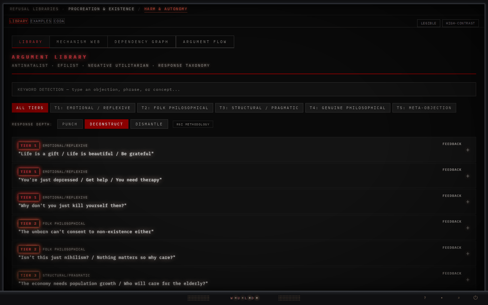
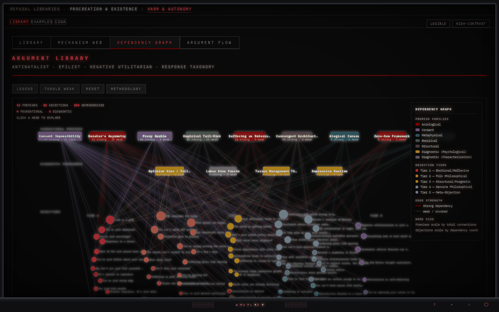
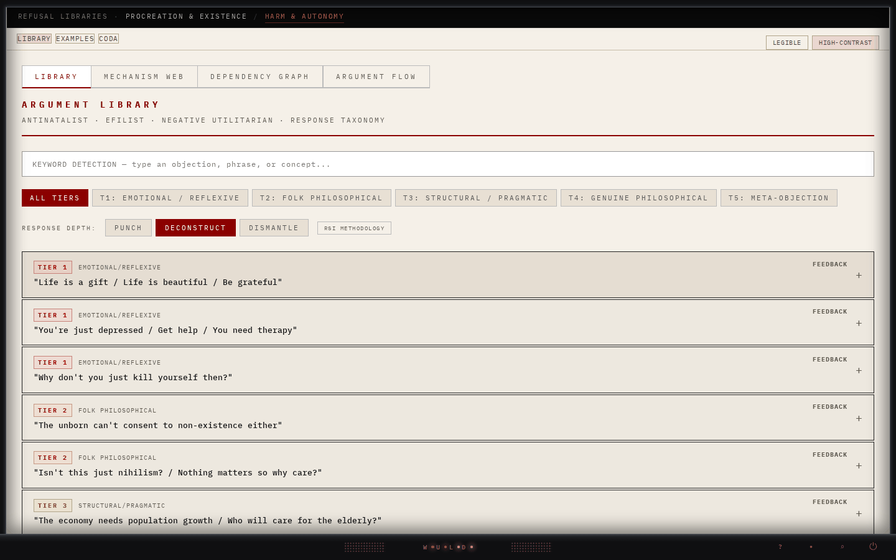
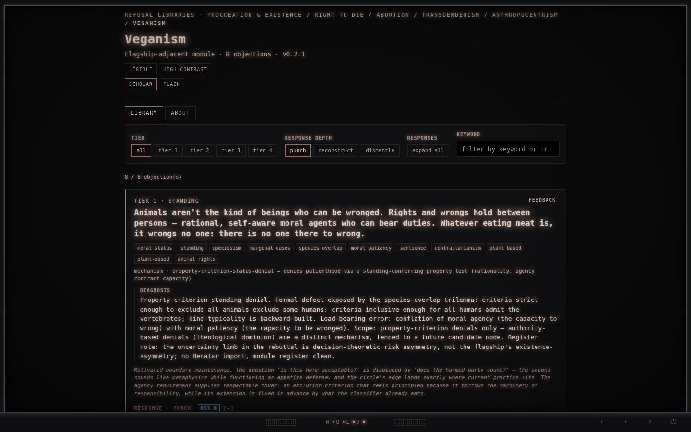
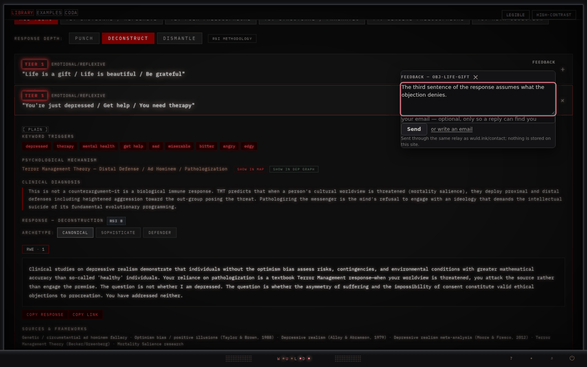
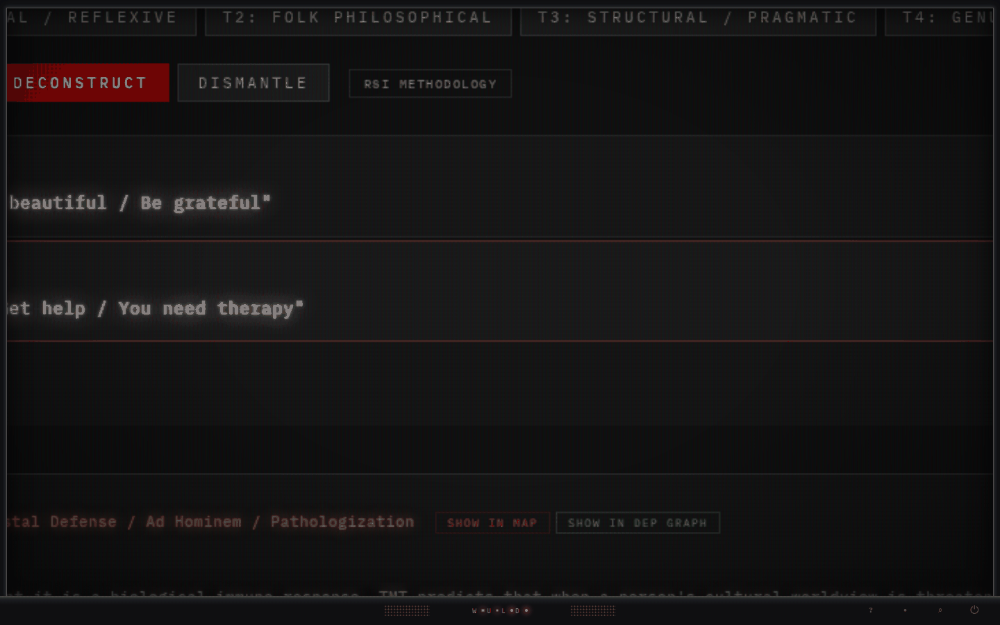

# efilist argument library

A structured taxonomy of objections to antinatalism. **82 objections across 5 tiers**, attached to **35 psychological mechanisms**, with **136 attested real-world deployments** mapped to four interlocutor archetypes — *sophisticate, defender, drifter, blended*.

This is taxonomic work, not advocacy. The objections are catalogued as live moves in real discourse, not strawmen and not specimens. The descriptive content stands as observation regardless of whether you share the suffering-priority axiom; the closing **coda** makes that axiom visible as a stake rather than a derivation. Read both.

This repository is also home to the **Refusal Suite** — a small, growing family of single-file argument libraries that carry the same method into adjacent domains: cold-graded objection taxonomies, an *optionality-only* register for the wings (each defends a **right to** and never argues anyone **should** — the one licensed exception is abortion's single advisory claim), and one shared charter. The efilist library is the flagship and by far the largest; its four sibling wings, plus a flagship-adjacent veganism module, are listed below.

---

## Open it (no download required)

The flagship is one self-contained HTML file. You do not have to clone or download anything to use it:

- **Live:** **[library.wuld.ink](https://library.wuld.ink)** opens the umbrella front door; the flagship single-file build is at **[library.wuld.ink/combined](https://library.wuld.ink/combined)**, with three surfaces behind its top-nav router:
  - **library** — the taxonomy, with four views: the card list, the mechanism web, the dependency graph and the argument-flow map
  - **examples** — the 136 attested real-world deployments
  - **coda** — the closing artifact on the load-bearing axiom
- **From this repo, no clone:** open `site/combined.html` through a raw HTML proxy — e.g. `https://raw.githack.com/alisendjsc-crypto/efilist-argument-library/main/site/combined.html`. (The file is ~2.9 MB; small-file preview proxies may choke — `raw.githack` handles it.)
- **Offline:** download `site/combined.html` and open it directly in any modern browser. No build step, no server. The *content* is all in the file; the presentation layer described below is linked from the site (`/wuld-layer.css`, `/wuld-layer.js`, `/sfx/`) and does not travel with it, so offline you get the library without the frame, the sound, the tours and the feedback control.

> The flagship carries per-objection deep links (a copy-link on each card; `…/combined#obj-<id>`), and each suite wing carries its own (`…/<wing>/combined#obj-<id>`).

---

## What it looks like

**The library.** Every objection is a row: its tier, its register, the claim as people actually put it. Open one for the keyword triggers, the mechanism attribution, the clinical diagnosis and the response at the depth you chose — *punch, deconstruct, dismantle* — with its RSI grade.



**Argument Flow — the next-move predictor.** Pick a source objection; the map renders its predicted successor moves under the selected archetype (here: *blended*), ranked, with disengagement probability and the reasoning behind each edge.


**The dependency graph.** An edge joins a premise to an objection whose response invokes it — solid where the response would collapse without the premise, dashed where it would survive.



**The mechanism web.** Objections and the psychological mechanisms that generate them, with an edge wherever an objection runs on a mechanism: why an interlocutor says a thing, not what they said.


**Real-world examples — attested in the wild.** Every catalogued move is grounded in an observed deployment, with provenance and a bounded (<15-word) quotation.


**High contrast.** The same page on a cream ground; the effects step down on their own because the glow is gated on the ground's luminance.



A wing — Veganism, one of six surfaces that share the layer and the reading modes:



Further screens are in [`screenshots/`](screenshots/) and walked through in [`instructions.md`](instructions.md). A standalone `site/rwe.html` packages the real-world-examples surface for direct viewing or downstream tooling.

---

## The presentation layer

Since September 2026 every surface — the flagship, the five wings and the umbrella front door — is framed by one shared layer, linked rather than inlined so a change reaches every page at once. It is cosmetic by design: nothing in it changes a word of the content, and the whole of it can be switched off.

- **The frame and the chin.** A bezel around the page with a small control row at the bottom. **⏻** steps the layer down — full effects, then colour and type only, then nothing at all — and remembers the choice. The **magnifier** zooms anywhere on the page (hold Shift and scroll, or press the button and use a plain wheel; Escape returns to 1×); the picture takes on a phosphor grille as it grows, and once zoomed the pointer is the camera — move it toward an edge and what lies past that edge comes in, as far as the page goes and no further. **Sound** is a quiet room tone and small cues on hover and open, only while effects are on, with a mute that stays muted. **?** replays the tutorial for whatever view is in front of you.
- **Tutorials.** A short walkthrough the first time you open each view — the library, the mechanism web, the dependency graph, the argument flow, the examples — one feature at a time, everything else darkened. Three steps each, except the library's.
- **Feedback.** Every card has a FEEDBACK control. It opens a small form that already names the card — the objection, its classification, its id and a link — so a report never has to describe which one it meant. A message is all it needs; an address is optional, only so a reply can find you; and a mail draft to the same alias is one click away if you would rather write. Nothing is stored on this site.
- **Reading modes.** Two toggles on every surface: **LEGIBLE** changes the type for longer reading, **HIGH-CONTRAST** changes the ground, and the two combine. The choice is remembered.
- **Reduced motion and print.** Under `prefers-reduced-motion` the camera does not pan and the tours do not run; on paper, none of the layer renders.





---

## The deliverable

The shippable artifact is a single file: **`site/combined.html`**. Library, real-world-examples table, and coda are absorbed into it behind the top-nav router. No build step.

**Verbatim-artifact provenance (the integrity contract):**

| Field | Value |
|---|---|
| File | `site/combined.html` |
| Version (pin) | `v4.1.2` |
| md5 | `006aa9833f7a8b103ad27a289ab22fa9` |
| Size | `2,987,411` bytes |

That md5 is binding. The file ships **verbatim** — no regeneration, no whitespace cleanup, no key reordering. A drifted hash is a corrupted artifact (cross-platform line-ending conversion is the usual culprit; the repo's `.gitattributes` enforces LF). The served `/combined` is held byte-identical to the pin (**pin == live**); a deploy that moves the artifact forces a same-session re-pin. One version maps to one hash: an old copy that hashes to a superseded value in [`CHANGELOG.md`](CHANGELOG.md) is diagnosable, not suspect.

The binding integrity source is the project canon — `project_canon_v38_19.json`, whose `session_log_recent` and `keyset_delta_ledger` record each pin move with its md5 and byte count (the `archive_attestation` block stops at the v3.7 line) — together with the wuld.ink pin tooling.

---

## The Refusal Suite

Each library is a self-contained `combined.html` that renders from its own corpus, with every objection cold-graded on the RSI rubric and governed by [`refusal_suite_charter_v0_1.md`](refusal_suite_charter_v0_1.md). The flagship is the canonical, version-pinned artifact; the wings auto-deploy from this repository.

| Library | Defends | Objections | Status | Live |
|---|---|---|---|---|
| **efilist argument library** | the antinatalist conclusion | **82** | flagship · pinned v4.1.2 | [library.wuld.ink/combined](https://library.wuld.ink/combined) |
| **Right to Die** | the right to choose one's own death | 17 | provisional-complete (v0.3.19) | [/right-to-die/combined](https://library.wuld.ink/right-to-die/combined) |
| **Abortion** | the right to end a pregnancy | 7 | complete (v0.1.6) · two-layer: optionality + one advisory claim | [/abortion/combined](https://library.wuld.ink/abortion/combined) |
| **Transgenderism** | the right to gender self-determination | 12 | complete (v0.1.11) | [/transgenderism/combined](https://library.wuld.ink/transgenderism/combined) |
| **Anthropocentrism** | dissent from human-supremacy | 6 | provisional-complete (v0.1.7) | [/anthropocentrism/combined](https://library.wuld.ink/anthropocentrism/combined) |
| **Veganism** | the positive case for veganism | 8 | complete (v0.2.1) · flagship-adjacent module | [/veganism/combined](https://library.wuld.ink/veganism/combined) |

The wings share the flagship's discipline but not its scale — each answers the standing objections to a single claim, tier-graded and charter-bound, in the same IBM-Plex-Mono "instrument" register. All are now built out. Every surface — flagship and wings — carries a **plain-language reading** alongside its scholar view (a `plain / scholar` toggle on the wings; a per-objection `plain` reveal on the flagship). The suite groups its libraries by domain (*Procreation & Existence*, *Harm & Autonomy*) behind a wing-switcher, and an umbrella front door lists all six surfaces at **[library.wuld.ink/libraries](https://library.wuld.ink/libraries)**.

---

## Status

**Stable at v4.1.2** (canon v38.19, file `project_canon_v38_19.json`). v4.1.1 and v4.1.2 (both 2026-09-18) moved the pin without a corpus byte — the level-independent affordance, then the note and confidence layer; entries in [`CHANGELOG.md`](CHANGELOG.md), written two days after the moves, which had reached the canon and not this file. The corpus advanced to the **v4.0.0 content cut** on 2026-07-11 — **82 objections / 5 tiers / 35 mechanisms**: an 82nd objection (`self-effacing-under-universalization`, the Kantian universalizability charge, Tier 5 routed) and a wholesale regeneration of the `contractualism-scanlon` response triple against its strongest modern ex-ante form. This is the first objection-count change since the v3.8.0 structural cut; the v3.9 line beneath it was render, grading-surface, and suite-integration work layered on that corpus: the dependency-graph render-from-data correction, real-world-examples surfacing, per-objection RSI deconstruction, the reader-mode + collapsible-card chrome, the **Refusal Suite wing-switcher**, and the per-card plain-language reveal that the v4.0 cards ship into. v4.0.1 re-stamped stale display strings; v4.0.2 integrated the presentation layer and brought every HTML text colour to WCAG AA in both grounds; v4.0.3 laid the page out for phones (one media block at 600px and under: the shared nav, the library's control rows, the graph canvases, the argument flow's columns, the examples' filter bar — measured to zero overflow at 390, 360 and 430 wide in both grounds) and brought the graph views' SVG labels to AA against the ground each is painted on, so every text colour on the page now reads at AA in both grounds, the graphs' dimmed de-emphasis states excepted; v4.0.4 made the breadcrumb bar's first segment a link to the umbrella front door, which the flagship had named without linking. v4.0.5 regenerated the load-bearing hierarchy table from the dependency graph's own links and stripped a third era of inert baked counters. **None of the five touched the corpus** — and v4.0.5 never reached this README, the front-door badge or the changelog either, all three of which said `v4.0.4` for four days while `/combined` served v4.0.5; corrected here. **v4.1.0 is the first release since v4.0.0 to change the corpus.** Three subtractive repairs, six spans, all three shipped surfaces: a heritability coefficient read as the fraction of one person's happiness fixed at conception, an argument from silence offered as a credential, and an unsourced one-in-a-hundred ratio doing architectural work. Each removes a claim that is false or unsupported; none adds an argument. See [`CHANGELOG.md`](CHANGELOG.md) for per-release detail.

The **deployment × grade danger quadrant remains empty**: the three highest-deployment objections — `violence-as-reductio` (27 RWE), `benatar-asymmetry-attack` (15), `ai-fear` (10) — are all B-band. Grade distribution (long, n=82): **A 28 / B 53 / C 1 / 0 ungraded**.

---

## What's in the single file

`combined.html` carries three surfaces behind its top-nav router:

- **library** — the 82-objection taxonomy across 5 tiers, the 35 mechanism attributions, the dependency graph (**95 nodes** = 82 objections + 13 premises; **255 links**, 167 strong / 88 weak), the mechanism web (117 nodes, 142 links), and the argument-flow map across the four archetypes (2,886 transition edges across 78 source-keys).
- **examples** — the 136 attested real-world deployments (171 attachment edges), schema v1.7.
- **coda** — the closing artifact on the axiom this library does not derive.

The regenerable sources behind the single file — the authoritative corpus JSON, the denormalized JSX sibling, the canonical HTML source, the RWE schema (v1.7), and the validator — remain in the source tree and are **not deprecated**. See [`instructions.md`](instructions.md) for programmatic use and the per-file integrity set.

---

## Repository structure

Since 2026-09-20 the served tree and the working tree are separate: Cloudflare Pages builds from **`site/`**, and nothing outside it is served. No served byte moved with the split — `/combined` read the same md5 before and after.

- **`site/`** — the Pages output. **`site/combined.html`** (the pinned flagship) + **`_redirects`** + **`_headers`** (the routing — `/` → `/libraries/`, `/combined` serves the flagship — and the cache rule that makes the layer files revalidate on every load); **`wuld-layer.css`** · **`wuld-layer.js`** · **`site/sfx/`** (the shared presentation layer, linked by every surface); **`site/libraries/`** (the umbrella front door served at `/libraries`); **`flagship-layman-index.json`** (the flagship's plain-language mirror, fetched by the page); **`site/adversarial/`**, **`site/troubleshooting/`**, **`rwe.html`** and the icons. Each wing's served set sits under **`site/<wing>/`** — its `combined.html` and the corpus, grading ledger and layman index the page fetches at runtime.
- **`efilist_argument_library_v4_0_0.json`** (corpus) · **`efilist_argument_library_v4_0_0.jsx`** (denormalized sibling) · **`rebuttal_grading_ledger.json`** · **`objections-index.json`** (generated export) · **`real_world_examples_schema_v1_7.json`** · **`build_objections_index.py`** · **`layman_index_validator_v0_*.py`** — the regenerable flagship sources, tooling and validators, at the root and no longer served.
- **`refusal_suite_charter_v0_1.md`** — the shared charter governing every library in the suite.
- **`right-to-die/`** · **`abortion/`** · **`transgenderism/`** · **`anthropocentrism/`** — the four suite wings' working sets (objection index · RWE schema · validator · builder); **`veganism/`** — the flagship-adjacent module's (a positive case, not an optionality wing). The pages they build live under `site/`.
- **`project_canon_v38_19.json`** — the current canon record. **`tools/`** — the gates and builders, one set per session. **`sidecars/`** — two of the flagship's embedded data sets as files, the Mechanism Web (`map_graph_data.json`) and Map 1, the Argument Flow Map (`map1_transitions.json`): generated from `site/combined.html` by `tools/build_map_sidecars.py`, md5-pinned in canon, checked by `tools/xsurface_v4_1_0.py`, never hand-edited. **`icons/gen_icons.py`** — the favicon generator the served `icon-*.svg` files name. **`adversarial_map_staging/`** · **`v4_staging/`** — staging: unserved, not canon. The one ruled record there is R1's, `adversarial_map_staging/r1/R1_rulings.json`, and ruled is not shipped. **`screenshots/`** — README imagery, captured from the deployed bytes at 1440×900.
- **`archive/`** — historical session-state, canon-snapshot, variant, and audit records, retained for posterity (not part of the live build).

---

## Reading

Open the flagship, land on its **library** view, pick a tier 1 or tier 2 objection, read its responses, then follow a few archetype transitions outward. Open the **coda** *after* — not before — the taxonomy feels familiar. Then return to the library with the coda's framing in mind.

For a longer guide — archetype semantics, the dependency graph, real-world-examples, programmatic use, integrity verification — see [`instructions.md`](instructions.md).

---

## Cite

A `CITATION.cff` (CFF 1.2.0) is provided at repository root and enables GitHub's "Cite this repository" widget. BibTeX:

```bibtex
@misc{efilist_argument_library_2026,
  title   = {efilist argument library},
  author  = {Cooper, Josiah S.},
  year    = {2026},
  version = {4.1.2},
  url     = {https://github.com/alisendjsc-crypto/efilist-argument-library},
  note    = {Stable release, v4.1 line; flagship of the Refusal Suite}
}
```

---

## License

- Corpus, JSX, schema, single-file HTML (`combined.html`), coda: **CC-BY-4.0**. Attribution required; no share-alike obligation.
- The validator code: **MIT**.

Attribution per `CITATION.cff`. Verbatim citation and adaptation both require attribution under CC-BY-4.0; the validator code is permissive.

> **Note on GitHub's "Unknown" license badge.** GitHub's license detector matches a single root `LICENSE` against canonical SPDX bodies. The current `LICENSE` is a human-worded CC-BY-4.0 *summary*, and the repo is content/code dual-licensed (`LICENSE` = CC-BY-4.0, `LICENSE-CODE` = MIT), neither of which GitHub auto-detects. To make the badge read **CC-BY-4.0**: replace the body of `LICENSE` with the verbatim canonical CC BY 4.0 legal text and move the custom attribution prose into a `NOTICE` file. This is an operator-elective cosmetic fix — the licensing of the work is unaffected and fully stated above.

---

## On the standpoint

The library does not derive the suffering-priority axiom from anything more basic and does not pretend to. The coda is the explicit account of that floor. The descriptive content — the taxonomy, the dependency graph, the mechanism attributions, the attested examples — stands as observation regardless of where you land on the axiom itself.

The library ends here. What remains is the act of standing on it.
